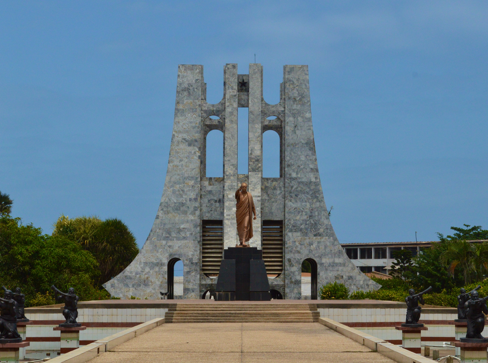

# Exercises_02

## FACTS ABOUT GHANA

1. Ghana is a country located in West Africa, bordered by Cote d'Ivoire to the west, Burkina Faso to the north, Togo to the east, and the Gulf of Guinea to the south.

2. Accra is the capital city of Ghana, and it is a bustling city that is home to many cultural landmarks, including the Kwame Nkrumah Memorial Park and the National Museum of Ghana.
   
3. The economy of Ghana is diverse and includes agriculture, mining, and manufacturing industries. Cocoa is the country's primary agricultural export, and gold is a major contributor to the mining industry.
   
4. The people of Ghana are known for their friendly and welcoming nature, as well as their vibrant culture, which includes traditional music, dance, and cuisine.
   
5. Ghana has made significant progress in recent years in terms of economic development, political stability, and social welfare, making it a country to watch on the African continent.

## Some nice places in Ghana

- National Theatre

- Kwame Nkrumah Museum

- Kakum National Park

